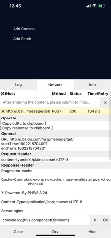

# react-native-vdebug


[](https://www.npmjs.org/package/react-native-vdebug)
[](https://npmcharts.com/compare/react-native-vdebug?minimal=true)
[](https://packagephobia.now.sh/result?p=react-native-vdebug)


`React-Native 调试工具`

### 支持情况
- [x] Command 自定义上下文
- [x] 复制 cURL 至粘贴板
- [x] 重新请求 URL
- [x] 可视化 Response
- [x] Log 等级分类
- [x] 关键字过滤 Log / Network
- [ ] Command 历史记录 (ing...)
- [ ] 导出所有 Log / Network (ing...)

## Install

[Install NodeJS and suggest >= 8.11.0](https://nodejs.org/zh-cn/)

## Usage

```JavaScript
npm install 'react-native-vdebug'

import VDebug, { initTrace, setExternalContext } from 'react-native-vdebug';

// Before component Render, perform Proxy Console/Network (Optional)
initTrace()

// Context object when the command is executed (Optional)
setExternalContext('your context')

return <VDebug 
  // Expansion panel (Optional)
  panels={[
    title:'your title',
    component: your component
  ]} 
  // Info panel (Optional)
  info={{ obj: 'your object' }} 
/>

```

## Snapshot


<br />

<br />

<br />

-------------------

[✶ MIT ✶](./LICENSE)